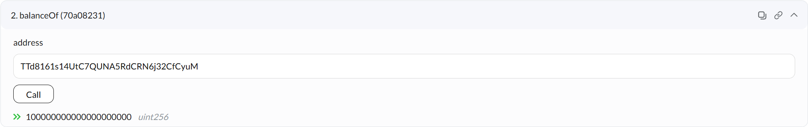
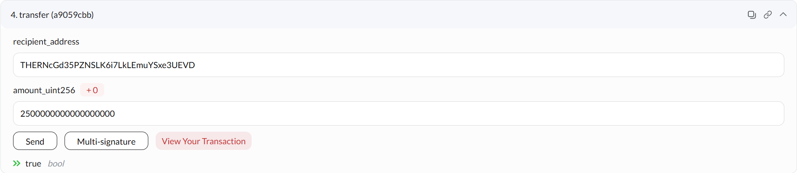
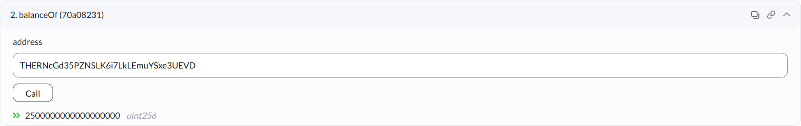
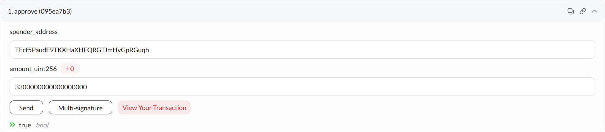
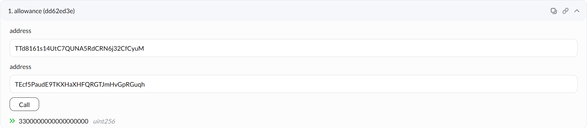
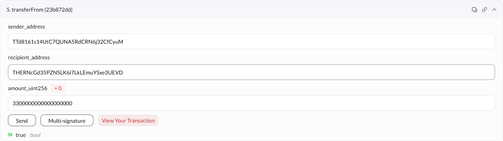
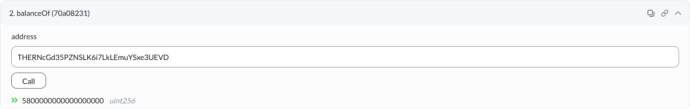
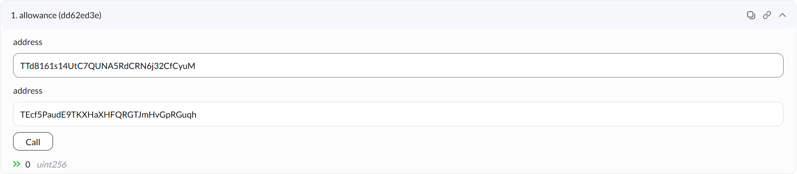

# 基础功能测试过程文档

## 测试使用3个账户地址：  
账户1：`TTd8161s14UtC7QUNA5RdCRN6j32CfCyuM`  
账户2：`THERNcGd35PZNSLK6i7LkLEmuYSxe3UEVD`  
账户3：`TEcf5PaudE9TKXHaXHFQRGTJmHvGpRGuqh`  

## 部署时分发100MTT代币
账户1 当前代币  

## 直接转账功能 Transfer
账户1 转账给 账户2 `2.5MTT`

账户2 当前代币持有

## 授权与授权转账 Approve & TransferFrom
### 授权功能
账户1 授权 账户3 `3.3MTT`

授权查询

### 授权转账
被授权方 (账户3) 发起 账户1 转账给 账户2 `3.3MTT`

账户2 当前货币持有

账户1 给 账户3 的授权代币已使用
